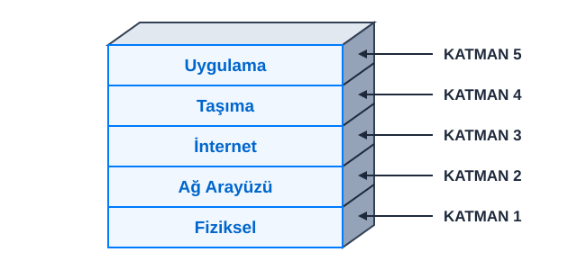
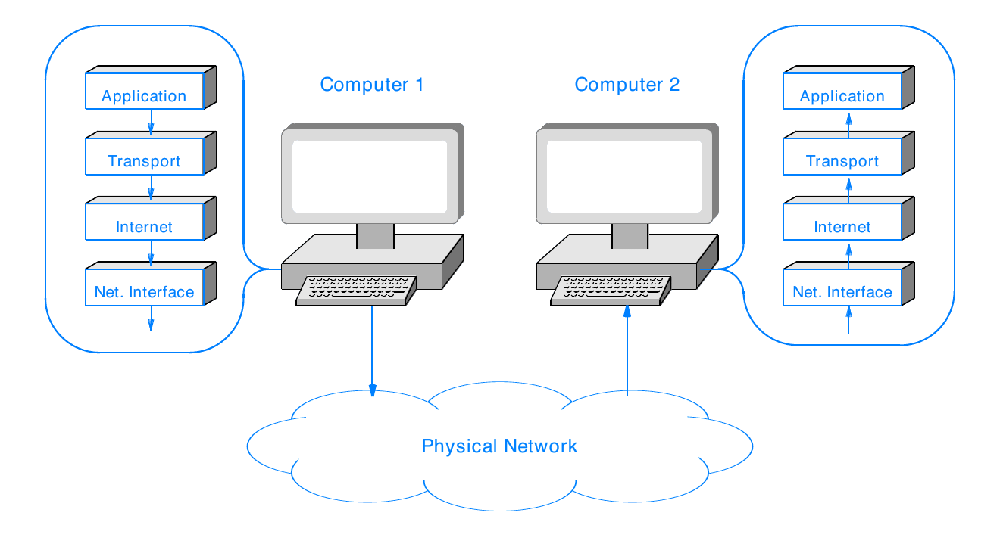
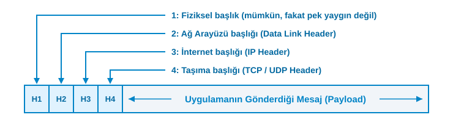
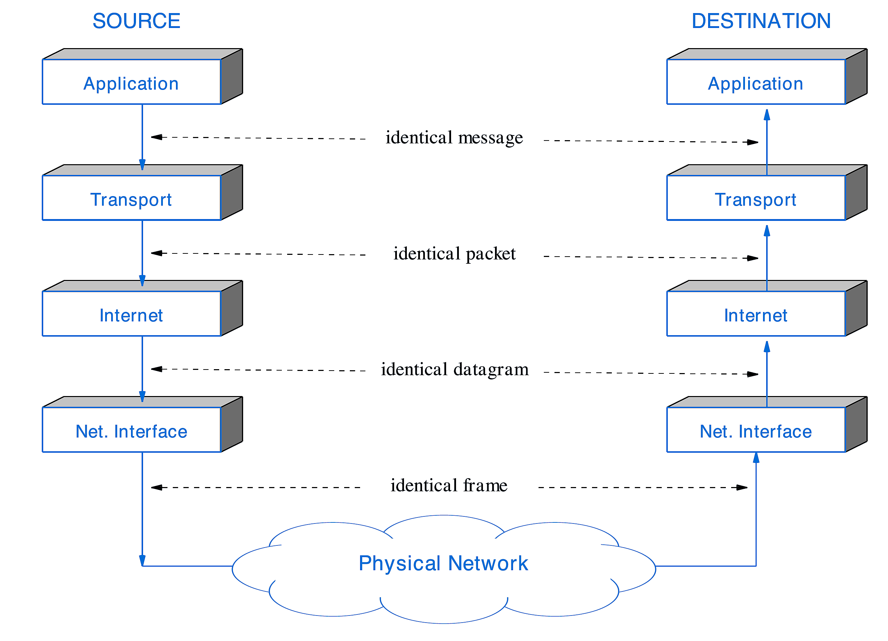
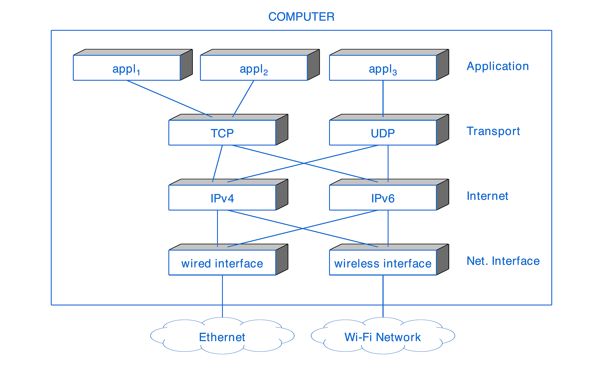
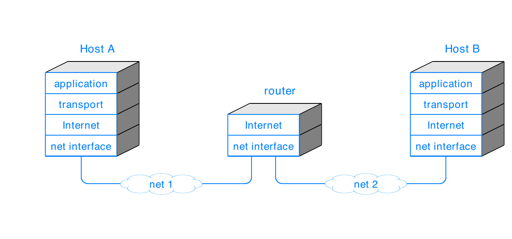
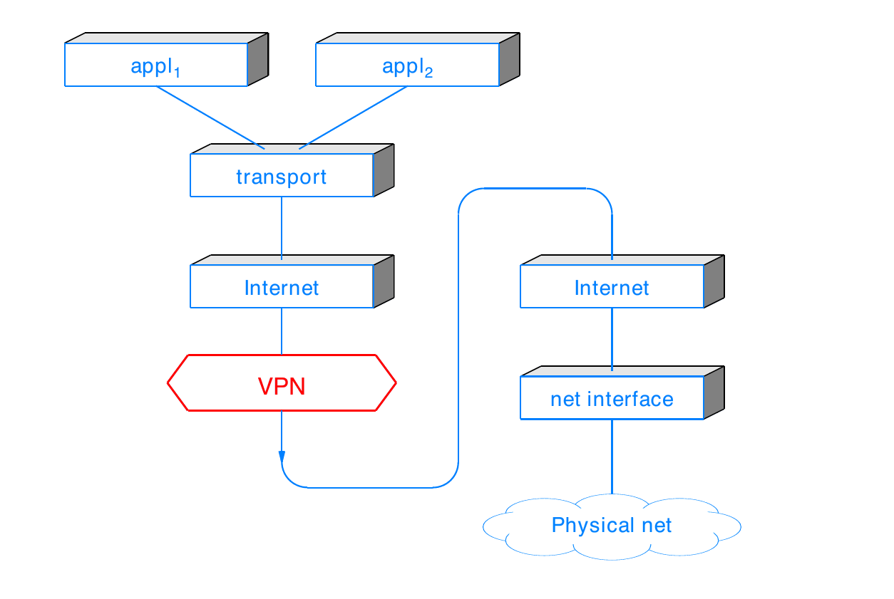

<!-- _class: lead -->
# Bilgisayar Ağları ve İnternet
## Modül 1: Giriş, Ders Özeti, Protokoller ve Katmanlı Mimari

**Prof. Douglas E. Comer**  
*6. Baskı Ders Notları - Türkçe Çevirisi ve Uyarlaması*

> Bu ders materyali, Prof. Douglas E. Comer'in *"Computer Networks and Internets, 6th Edition"* (Prentice-Hall / netbook.cs.purdue.edu) eserinden Türkçeye uyarlanarak hazırlanmıştır. Açık kaynak projesi: [github.com/gtanisik/bilgisayar-aglari](https://github.com/gtanisik/bilgisayar-aglari)

---

# Modül İçeriği

- Ders Özeti ve Kapsamı
- Ağ Sistemlerine Tarihsel Yaklaşımlar
- Açık ve Kapalı Ağ Sistemleri
- Protokol Standartları ve Protokol Tasarımı
- Protokol Katmanlaması ve Referans Modelleri (İnternet 5-Katman ve ISO 7-Katman)
- Kapsülleme (Encapsulation) ve Katmanlama İstisnaları

---

<!-- _class: lead -->
# Bölüm 1.1: Ders Özeti ve Kapsamı

---

# Konu ve Kapsam

- Bilgisayar Ağları ve İnternet:
  - Bireysel ağlarda ve küresel İnternet'te dijital iletişimin temelini oluşturan kavramlar, terminoloji ve teknolojilere genel bir bakış.

---

# Bu Derste Neler Öğreneceksiniz?

- Temel ilkeler ve prensipler
- Ağ kavramları
- Yoğun bir terminoloji (ağ terimleri dağarcığı)
- Bilgisayar ağlarının temel boyutları

---

<!-- _class: compact -->
# Ağ İletişiminin 5 Temel Boyutu

1. Veri İletişimi (Data Communications):
   - Kablolar üzerindeki sinyaller ve sinyaller üzerindeki bitler.
2. Ağlar (Networks):
   - Bitler üzerindeki paketler.
3. İnternetler / Ağlararası İletişim (Internets):
   - Paketler üzerindeki datagramlar (verigramlar).
4. Ağ Programlama (Network Programming):
   - İnternet üzerindeki uygulama verileri.
5. Çapraz İşlevsel Kavramlar ve Teknolojiler:
   - Ağ konfigürasyonu, kontrolü, güvenliği ve yönetimi.

---

# Dersin Temel Özellikleri

- Ortamlardan (fiziksel kablolardan) uygulamalara kadar ağ yapısının tamamını kapsar.
- Temelde yatan teknolojilerin her birini inceler.
- Üreticilerden ve ürünlerden bağımsız, genel geçer kavram ve ilkelere odaklanır.
- Geniş bir perspektif sunar ve parçaların birbiriyle nasıl birleştiğini gösterir.
- Heterojen ağlardan bir İnternet'in nasıl kurulduğunu açıklar.

---

# Bu Derste Neler Öğrenilmeyecek?

- Ticari Boyutlar:
  - Satıcılar / Üreticiler
  - Ürünler ve fiyatlar
  - Pazarlar ve pazarlama
- Ağ donanımlarının mühendislik/elektronik tasarımı
- Ağların ticari operasyonu ve cihaz konfigürasyonu (örn. Cisco CLI)
- Yepyeni protokol tasarımı yapmak (derste var olan protokollere odaklanılır)

---

# Uygulama Dersleri ve Laboratuvarlar

- Dersin kritik ve önemli bir parçasıdır.
- Uygulamalarda Yapılacaklar:
  - Soket programlama ile ağ uygulamaları geliştirmek.
  - Paket yakalamak ve analiz etmek (Wireshark vb. araçlarla).
  - Protokol davranışlarını pratikte gözlemlemek.

---

# Beklenen Ön Bilgiler

- Amacımız tek bir konuda derinleşmekten ziyade geniş bir vizyon kazanmaktır.
- Gerekli Temel Beceriler:
  - C veya benzeri bir dilde programlama yapabilme.
  - Veri yapıları ve göstericiler (pointers) hakkında temel bilgi.
  - Temel cebir bilgisi.
  - İşletim sistemlerinin çalışma mantığına dair temel anlayış.
- En önemli gereksinim: Öğrenme isteği!

---

# Dersin Özeti

- Ağ kurmanın ve ağlararası iletişimin tüm yönlerini keşfeder.
- Temel kavram ve ilkeleri kazandırır.
- Büyük resme odaklanır.
- Programlama ve uygulama egzersizleri içerir.
- Hızlı ilerler ve geniş bir terim dağarcığını kapsar.

---

<!-- _class: lead -->
# Bölüm 1.2: Ağ Sistemlerine Tarihsel Yaklaşımlar

---

# Bir Ağ Nasıl Yapılandırılmalıdır?

1. Erken Dönem Telefon Şirketlerinin Yaklaşımı:
   - Veri iletişimi telefon aramalarına benzer.
   - Farklı veri hizmetleri tasarlayıp sunacağız.
   - Ücretlendirme mesafeye ve süreye bağlı olacaktır.
   - Sadece 128 Kbps yeterlidir!

---

# Bir Ağ Nasıl Yapılandırılmalıdır? (Devam)

2. Erken Dönem Bilgisayar Üreticilerinin Yaklaşımı:
   - Ağ, kurumunuzdaki bilgisayarları birbirine bağlar.
   - Gerekli tüm donanım ve yazılımı biz üreteceğiz.
   - Sadece bizim bilgisayarlarımızı bağlamanız yeterlidir.
   - Sadece bizim uygulamalarımızı çalıştırmanız yeterlidir.

---

# Bir Ağ Nasıl Yapılandırılmalıdır? (Devam)

3. Erken Dönem Ağ Donanımı Üreticilerinin Yaklaşımı:
   - Ağ, bilgisayarlardan bağımsızdır.
   - Bilgisayarları ağa bağlayan donanım ve ağ arayüzlerini biz üreteceğiz.
   - İşletim sisteminiz için cihaz sürücüleri (device drivers) yazacağız.
   - Sadece bizim ağımızı kullanmanız yeterlidir!

---

<!-- _class: compact -->
# Ortaya Çıkan Bazı Ticari Ağ Sistemleri

Geçmişte üreticiye bağımlı olarak geliştirilen ticari ağlar:

- Apple Computer AppleTalk
- Banyan VINES
- Digital Equipment Corporation DECNET
- IBM SNA (Systems Network Architecture)
- Novell NetWare
- Ungermann-Bass NET/One
- Xerox XNS

---

# Araştırmacıların (Akademinin) Yaklaşımı

- Farklı konumlarda bilgisayarlarımız olmasına rağmen telefon şirketlerinin yaklaşımını reddediyoruz.
- Farklı bilgisayar mimarileri kullandığımız için bilgisayar üreticilerinin yaklaşımını reddediyoruz.
- Çeşitli ağ teknolojileri mümkün olduğu için tek bir ağ üreticisinin yaklaşımını reddediyoruz.
- Yaklaşımımız:
  - Yeni teknolojilerle (kısa ve uzun mesafe) ve yeni uygulamalarla deneyler yapalım!
  - Heterojen ağları birbirine bağlayan ortak bir standart geliştirelim.

---

<!-- _class: compact -->
# Ortaya Çıkan Araştırma Projeleri

- Xerox PARC (Palo Alto Research Center):
  - Ethernet yerel ağ teknolojisi.
- MIT ve Diğer Kurumlar:
  - Token Ring (Jetonlu Halka) ağları.
- ABD Savunma Bakanlığı (DoD / DARPA):
  - ARPANET (İnternet'in atası)
  - SATNET (Uydu Ağı)
  - Packet Radio Net (Paket Radyo Ağı)
  - Ve günümüzün küresel İnternet'i!

---

<!-- _class: lead -->
# Bölüm 1.3: Açık ve Kapalı Ağ Sistemleri, Protokol Standartları

---

<!-- _class: compact -->
# Açık vs. Kapalı Ağlar

### Kapalı Ağlar (Closed Networks)
- Dikey (vertical) yaklaşım.
- Tek bir şirket tarafından tasarlanır ve üretilir.
- Teknoloji mülkiyeti firmaya aittir (Patentli/Proprietary).

### Açık Ağlar (Open Networks)
- Rekabetçi ve katılımcı yaklaşım.
- Birden fazla grup bir araya gelerek teknolojiyi tanımlar.
- Birlikte çalışabilirliği (Interoperability) sağlamak için spesifikasyonlar herkesin erişebileceği Standart Belgelerinde yayınlanır.
- Şirketler ürünlerini bu ortak standartlara göre üretir.

---

# Neden Standartlaştırıyoruz?

- Ağ iletişimi, birden fazla farklı varlığın (farklı cihazlar, farklı işletim sistemleri) birbiriyle haberleşmesini gerektirir.
- Standartlar olmasaydı A markası bir bilgisayar, B markası bir bilgisayarla konuşamazdı.

> 💬 **Sektör Esprisi**: *"Ağ programlaması neden bu kadar zordur? Çünkü seçebileceğiniz o kadar çok standart vardır ki!"*

---

<!-- _class: compact -->
# Standart Yayınlayan Kuruluşlar

- IEEE (Institute of Electrical and Electronics Engineers):
  - Wi-Fi (802.11), Ethernet (802.3) standartları.
- IETF (Internet Engineering Task Force):
  - İnternet standartları (RFC belgeleri).
- ISO (International Organization for Standardization):
  - OSI referans modeli.
- ITU (International Telecommunication Union):
  - Telekomünikasyon standartları.
- W3C (World Wide Web Consortium):
  - Web standartları (HTML, HTTP vb.).

---

# Protokol (Protocol)

- Her bir protokol, iletişimin belirli bir yönünün nasıl ele alınacağını belirtir.
- Bir protokol şunları belirtebilir:
  - Voltaj ve frekans gibi alt seviye (fiziksel) detaylar.
  - Kullanıcının gördüğü biçim/format gibi üst seviye detaylar.
- Çok sayıda bireysel iletişim protokol standardı mevcuttur.
- Birlikte çalışmak üzere tasarlanmış protokol kümesine **Protokol Takımı / Kümesi (Protocol Suite)** denir.
  - Örnek: TCP/IP İnternet protokol takımı (TCP/IP Internet protocol suite).

---

# Protokollerin Tanımladığı İki Temel Özellik

1. Sözdizimi (Syntax):
   - Verinin formatı ve yapısı.
   - Mesajın içindeki alanların sırası, uzunluğu ve bit seviyesindeki gösterimi.

2. Anlam / Semantik (Semantics):
   - Gelen bitlerin veya kontrol alanlarının ne anlama geldiği.
   - Bir mesaj alındığında hangi eylemin gerçekleştirileceği veya nasıl bir yanıt döneceği.

---

# Protokol Tasarım Adımları

1. Taban teşkil eden donanımın sağladığı imkanlara bakılır.
2. Sağlanmak istenen ideal hizmet / işlev hayal edilir.
3. Donanımın sundukları ile ideal hizmet arasındaki farkı kapatacak algoritmalar ve mesaj formatları tasarlanır.

---

# Protokol Tasarımı Neden Zordur?

- Protokolün birden fazla farklı uyarlaması (implementation) olacaktır.
- Yazılımcılar veya mühendisler standart belgesini yanlış yorumlayabilir.
- Ağ üzerinde paket kayıpları, gecikmeler ve hatalar meydana gelebilir.

---

<!-- _class: compact -->
# Birlikte Çalışabilirliği En Üst Düzeye Çıkarma: Postel İlkesi

- İnternet'in öncülerinden Jon Postel tarafından ortaya konan dayanıklılık ilkesi (Postel's Law / Robustness Principle):

> **"Gönderirken muhafazakar (kesinlikle standarda uygun), alırken esnek (hoşgörülü) olun."**  
> *(Be conservative in what you do, be liberal in what you accept from others.)*

- Anlamı: Kendi ürettiğiniz paketler nizami standartlara birebir uymalıdır; ancak karşı taraftan biraz hatalı veya biçimsiz paket gelse bile sistemi çökertmeden işlemeye çalışmalısınız.

---

<!-- _class: lead -->
# Bölüm 1.4: Protokol Katmanlaması ve Katmanlı Modeller

---

# Protokol Katmanlaması (Protocol Layering)

- İletişim karmaşık olduğu için gereklidir
- Öncelikle protokol tasarımcıları için hedeflenmiştir
- İletişimi zihinsel olarak yönetilebilir parçalara böler
- Protokolleri anlamamıza yardımcı olan kavramsal bir çerçeve sunar
- İdeal olarak, protokoller tasarlandıktan sonra katmanlama görünmez hale gelir
- Notlar:
  - Katmanlama katı bir çerçeve değil, bir rehberlik sunar
  - Optimizasyonlar katı katmanlamayı ihlal edebilir

---

# İki Temel Katmanlı Referans Modeli

- İnternet protokolleri 5 katmanlı bir referans modeli kullanır.
- ISO ve ITU 7 katmanlı bir model tanımlamıştır.

---

# İnternet Referans Modeli

- TCP/IP protokol kümesi tasarlandıktan sonra oluşturulmuş **tanımlayıcı** bir modeldir.
- Pratikte fiilen kullanılan modeldir.

---

# Katman 1: Fiziksel Katman (Physical Layer)

- Altta yatan iletim ortamları
- Elektromanyetik enerji ve bunun kullanımı
- Bilginin sinyallerde gösterimi
- Radyo frekansları ve voltaj gibi elektriksel özellikler
- İlgili donanımlar

---

<!-- _class: compact -->
# Katman 2: Ağ Arayüz Katmanı (Network Interface Layer)

- Bilgisayar ile ağ donanımı arasındaki iletişim
- Veri bağı (Data Link) veya MAC katmanı olarak da adlandırılır
- Paylaşılan ortama erişim sağlama mekanizmaları
- Donanım (MAC) adreslemesi
- Paket (çerçeve / frame) formatları
- Paket (çerçeve) tipleri ve tekleme/ayrıştırma (demultiplexing)
- Hata algılama (Error detection)

---

<!-- _class: compact -->
# Katman 3: İnternet Katmanı (Internet Layer)

- İnternet üzerindeki bir bilgisayar çifti arasındaki iletişim
- İnternet paket formatı (datagram / verigram)
- İnternet adresleme modeli ve adres atama
- İnternet paketlerinin yönlendirilmesi (forwarding)
- Bir İnternet paketinin iletim için daha küçük paketlere bölünmesi
- Hata algılama ve raporlama

---

# Katman 4: Taşıma Katmanı (Transport Layer)

- Bir bilgisayardaki uygulama çiftleri arasındaki iletişim
- Bilgisayardaki birden fazla hedef/uygulama arasında ayrıştırma (Demultiplexing)
- Güvenilir teslimat ve yeniden iletim (Reliable delivery & retransmission)
- Veri hızını kontrol etme ve tıkanıklığı önleme mekanizmaları

---

# Katman 5: Uygulama Katmanı (Application Layer)

- Verilerin ve mesajların formatı ve gösterimi
- Uygulamaların izlediği prosedürler:
  - Veri aktarımı yapmak
  - Hataları veya beklenmeyen durumları ele almak
- Değiş tokuş edilen mesajların anlamı
- Yönlendirme (routing) ve DNS gibi İnternet altyapı servisleri

---

<!-- _class: compact -->
# Katmanlı Protokollerin Çalışma Mantığı

- Her bilgisayar, katmanlı protokol kümesinin tamamını içerir.
- Bir uygulama bir mesaj gönderdiğinde:
  - Mesaj katmanlı protokoller boyunca aşağıya doğru iner.
  - İlgili katman bilgi ekler ve bir paket oluşturur.
  - Bilgisayar nihai paketi iletir.
- Bir paket ulaştığında:
  - Paket protokol katmanları boyunca yukarıya doğru çıkar.
  - İlgili katman gerekli işlemeyi yapar ve paketi bir üst katmana devreder.
  - Uygulama gönderilen mesajı teslim alır.

---

<!-- _class: compact -->
# Bilgisayardaki Protokol Yazılımlarının Gösterimi

- Bir bilgisayardaki protokoller kavramsal bir yığın (stack) şeklinde düzenlenir.

---

# Kapsülleme ve Paket Başlıkları

İnternet üzerinde hareket eden bir paketin katman katman sarmalanması:

- Her katman bir alt katmanın Yükü (Payload) haline gelir.

---

# Katmanlama İlkesi

- Katmanlı protokoller değişmez bir kuralı (invariant) zorunlu kılar:

> **"Hedefteki N. Katman, kaynaktaki N. Katmanın gönderdiği mesajın birebir aynısını alır."**

- Kaynakta alt katmanlar tarafından eklenen tüm başlıklar ve değişiklikler, hedefte karşılık gelen alt katmanlar tarafından çıkarılmalıdır.
- Bu ilke, protokol tasarımcısının sadece tek bir katmana odaklanmasını sağlar.

---

# Katmanlama İlkesinin Görsel Özeti

---

# Katmanlamadaki Bazı İnce Karmaşıklıklar

- Katmanlama diyagramları soyut ve basitleştirilmiştir.
- Detaylar ve istisnalar pratik sistemleri karmaşıklaştırır.
- Dört temel örnek:
  - Çapraz katman iletişimi (Cross-layer communication)
  - Katman başına birden fazla protokol (Multiple protocols per layer)
  - İnternet ortamında katmanlama (Layering in an Internet)
  - Katmanları birbiriyle iç içe geçiren teknolojiler (Technologies that intertwine layers)

---

# Çapraz Katman İletişimi Örneği

- Temel olgular:
  - Bir taşıma protokolü, her bir pakette gönderilecek veri miktarını belirler.
  - Performansı optimize etmek için paketlerin tam dolu olmasını ister.
- Ne var ki...:
  - Maksimum paket boyutunu bulmak için taşıma protokolünün bir alt katmanla etkileşime girmesi gerekir.

---

# Katman Başına Birden Fazla Protokol

- Tipik bir bilgisayarı düşünün:
- Kullanıcı aynı anda birden fazla uygulama çalıştırabilir:
  - E-posta (Email)
  - Web tarayıcısı (Web browser)
- Bilgisayar birden fazla fiziksel ağa bağlanabilir:
  - Kablolu Ethernet
  - Wi-Fi kablosuz ağ
- Diğer katmanlar da benzer şekilde birden fazla protokole sahiptir.

---

<!-- _class: compact -->
# Katman Başına Birden Fazla Protokol Görseli

---

# İnternet Ortamında Katmanlama

- Katmanlama diyagramlarımız şimdiye kadar yalnızca bir ağa bağlı iki bilgisayarı göstermektedir.
- Gerçek İnternet ise yönlendiriciler (router) ile birbirine bağlanan birden fazla ağdan oluşur.
- Yönlendiriciler, paketleri İnternet üzerinden iletmek için yalnızca 2. ve 3. katman yazılımlarına ihtiyaç duyar.

---

# İnternet Üzerinde Yönlendiricilerin Katman Yapısı

- Pratikte yönlendiriciler yalnızca paket iletmekten daha fazlasını yapabilir.
- Detaylarını dersin ilerleyen bölümlerinde inceleyeceğiz.

---

# Katmanları Birbirine Bağlayan Teknolojiler

- Tünelleme (Tunneling):
  - Bir Katman 3 protokolünün (örn. IPv6) başka bir Katman 3 protokolü (örn. IPv4) içinde taşınması.
- Sanal Özel Ağlar (VPN - Virtual Private Networks):
  - IP paketlerinin şifrelenerek tekrar IP paketleri içinde kapsüllenerek gönderilmesi.

---

<!-- _class: compact -->
# VPN Tarafından Kullanılan Katmanlama Gösterimi

---

<!-- _class: compact -->
# ISO 7-Katmanlı Referans Modeli Karşılaştırması

| ISO 7-Katman Modeli | İnternet 5-Katman Modeli | Açıklama |
|---|---|---|
| **7. Uygulama (Application)** | Uygulama | Kullanıcı servisleri |
| **6. Sunum (Presentation)** | *(Uygulama içinde)* | Veri formatı, karakter kodlama |
| **5. Oturum (Session)** | *(Uygulama içinde)* | Bağlantı yönetimi, oturum takibi |
| **4. Taşıma (Transport)** | Taşıma | Uçtan uca veri iletimi (TCP/UDP) |
| **3. Ağ (Network)** | İnternet | Yönlendirme ve IP adresleme |
| **2. Veri Bağı (Data Link)** | Ağ Arayüzü | Çerçeveler ve MAC adresleri |
| **1. Fiziksel (Physical)** | Fiziksel | Bitler ve kablolama |

- ISO modelindeki Sunum ve Oturum katmanları günümüz İnternet mimarisinde Uygulama Katmanı içerisine dahil edilmiştir.

---

# Modül 1 Özeti

- Ağ sistemleri Açık veya Kapalı olabilir.
- Protokol Standartları sözdizimi (syntax), semantik (anlam) ve hata yönetimini tanımlar.
- Postel İlkesi: *"Gönderirken muhafazakar, alırken esnek ol."*
- İnternet 5 Katmanlı Referans Modeli kullanır:
  1. Fiziksel, 2. Ağ Arayüzü, 3. İnternet, 4. Taşıma, 5. Uygulama.
- Her katman kendi başlığını ekler (Kapsülleme / Encapsulation).
- Yönlendiriciler (Router) paket yönlendirirken ilk 3 katmanı kullanır.

---

<!-- _class: lead -->
# Soru ve Tartışma

**Modül 1 Tamamlandı**  
*Gelecek Modül: Modül 2 - Ağ Programlama ve Uygulama Katmanı (Sockets, Web, DNS, Email)*
