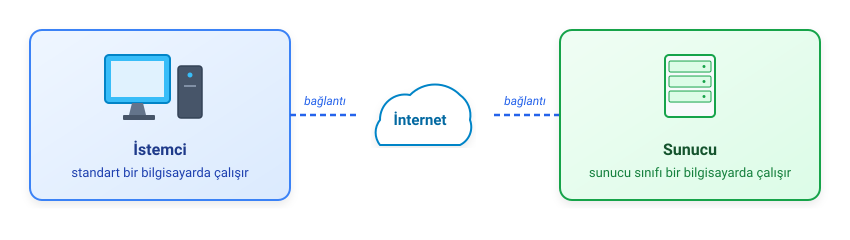
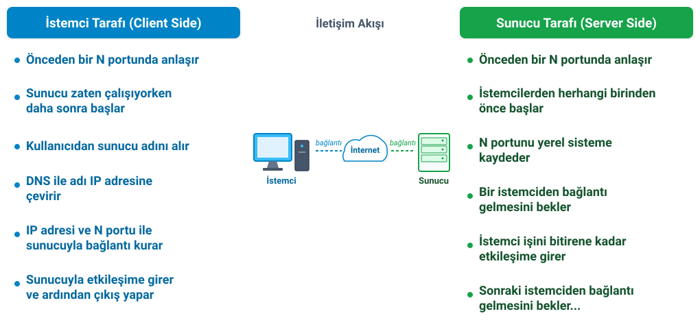
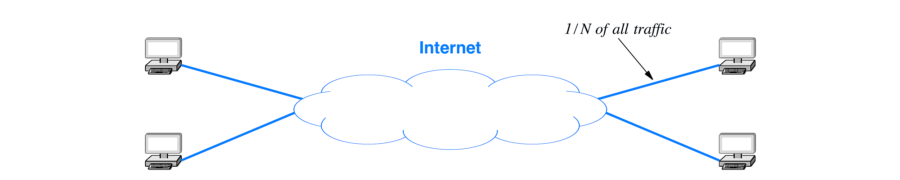
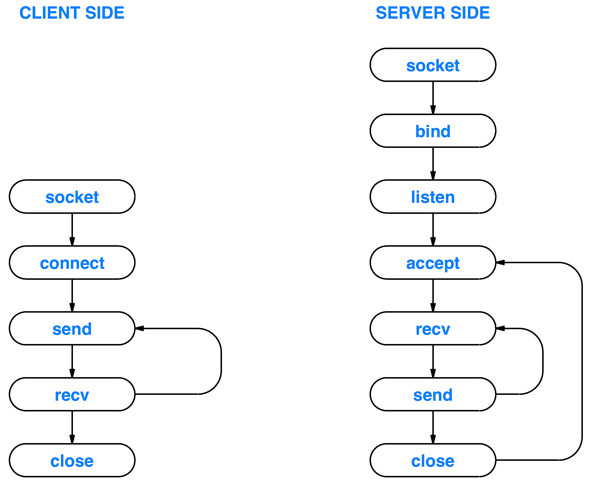
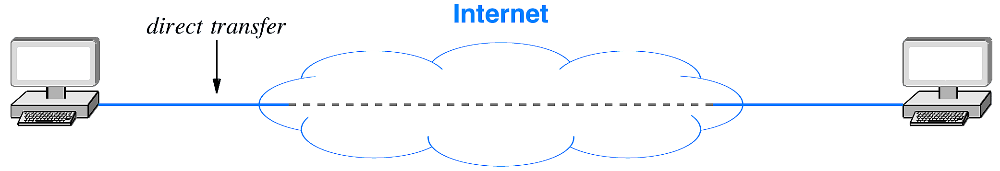
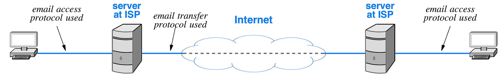

<!-- _class: lead -->
# Modül 2: Ağ Programlama ve Uygulama Katmanı

## Uygulama Katmanı Protokolleri, Soket API ve Ağ Mimarileri

**Prof. Douglas E. Comer** ders materyalinden uyarlanmıştır.

---

# Modül 2 Konu Başlıkları

- İnternet Hizmetleri ve İletişim Paradigmaları
- İstemci-Sunucu Modeli ve Alternatifleri
- Basitleştirilmiş Bir API ile Ağ Programlama
- Soket API (The Socket API)
- Uygulama Katmanı Protokolleri
- Standart Uygulama Protokolü Örnekleri

---

<!-- _class: lead -->
# Bölüm 2.1: İnternet Hizmetleri ve İletişim Paradigmaları

---

# Genel İlke: Zekanın Ağ Uçlarında Olması

- İnternet doğrudan hizmet sunmaz; yalnızca iletişim sağlar. Tüm hizmetleri uygulama programları sunar.
- Sonuç:
  - Sesli ve görüntülü telekonferans dahil tüm İnternet iletişimi, uygulama programları arasındaki iletişimden ibarettir.
  - Ağ çekirdeği basit paket iletimi yapar; karmaşık uygulama mantığı uç sistemlerde (host) çalışır.
  - Yeni bir uygulama eklendiğinde ağ altyapısının değiştirilmesi gerekmez.

---

# İletişim Paradigmaları Karşılaştırması

İnternet iki temel iletişim paradigması sunar:

| Özellik | Akış Modeli (Stream - TCP) | Mesaj Modeli (Message - UDP) |
|---|---|---|
| **Bağlantı Yapısı** | Bağlantı Tabanlı (Connection-oriented) | Bağlantısız (Connectionless) |
| **Etkileşim Türü** | Bire-bir İletişim | Bire-bir, Birden-çoğa, Birden-herkese |
| **Veri Birimi** | Bireysel Bayt Dizisi | Bağımsız Mesaj Dizisi |
| **Veri Boyutu** | Değişken / Rastgele Uzunluk | Mesaj Başına Maks. 64 KB |
| **Kullanım Alanı** | Çoğu Standart Uygulama (Web, E-posta) | Çoklu Ortam (Ses/Video, Oyun) |
| **Temel Protokol** | TCP Protokolü | UDP Protokolü |

- **Not**: Her iki paradigmanın da ilk bakışta şaşırtıcı gelen davranış özellikleri vardır.

---

# Akış Modeli (Stream Paradigm - TCP)

- Bir dizi baytı aktarır.
- Bağlantı tabanlıdır: Veri iki uygulama arasında gönderilir.
- İki yönlüdür (her iki yönde birer akış mevcuttur).
- Veriye herhangi bir anlam yüklenmez ve veri içine sınırlar yerleştirilmez.
- **Şaşırtıcı Özellik**:
  - Tüm baytları sırasıyla ulaştırmasına rağmen, akış modeli alıcı uygulamaya teslim edilen bayt bloklarının gönderici uygulama tarafından gönderilen bloklara karşılık geleceğini garanti etmez.

---

# Mesaj Modeli (Message Paradigm - UDP)

- Bağlantısızdır: Ağ, bağımsız mesajları kabul eder ve iletir.
- Gönderici bir mesaja N bayt yerleştirirse, alıcı gelen mesajda tam olarak N bayt bulur.
- Tekli yayın (unicast), çoklu yayın (multicast) veya genel yayın (broadcast) iletimini destekler.
- **Şaşırtıcı Özellik**:
  - Sınırları korumasına rağmen mesaj modeli paketlerin kaybolmasına, yinelenmesine veya sırasız teslim edilmesine izin verir; bu tür hatalar oluştuğunda ne göndericiye ne de alıcıya bilgi verilir.

---

# Akış Taşıma (Stream Transport) ve Veri Blokları (Data Chunks)

- Protokol sistemi şunları yapabilir:
  - Göndericiden gelen veriyi birden fazla segmente bölebilir ve alıcıya her defasında birkaç bayt teslim edebilir.
  - Birden fazla iletimden gelen veriyi tek bir büyük blokta birleştirip alıcıya hepsini tek seferde teslim edebilir.
- **Sonuç**: Alıcı uygulama hangi parçaların gönderildiğini tam olarak bilemez.

---

# Örnek #1

- İki uygulama arasında bir akış bağlantısı olduğunu varsayalım.
- Gönderici:
  - `buf` tamponuna 1000 baytlık mesaj yerleştirir.
  - 1000 baytın tamamını göndermek için tek bir istekte bulunur.
- Alıcı:
  - 1000 baytlık bir `b` tamponu ayırır.
  - Akıştan `b` tamponuna 1000 bayt okuma isteğinde bulunur.
- İşletim sistemi 1 ile 1000 bayt arasında bir miktar döndürebilir.
- Uygulama, 1000 baytın tamamı alınana kadar ard arda çağrılar yapmalıdır.

---

# Örnek #2

- İki uygulama arasında bir akış bağlantısı olduğunu varsayalım.
- Gönderici, her biri 100 bayt uzunluğunda 4 mesajlık bir dizi iletir.
- Alıcı 1000 baytlık büyük bir `b` tamponu ayırır ve akıştan `b` tamponuna 1000 bayta kadar okuma yapılmasını ister.
- İşletim sistemi tek bir okuma isteğinde 4 mesajın tamamını (400 bayt) döndürmeyi seçebilir.
- Alıcı uygulama, gelen veriyi 4 ayrı mesaja kendisi ayırabilmelidir.

---

# Programlama İpuçları

- **Akış Modeli (TCP) Kullanırken**:
  - Alıcının bir mesajın nerede bittiğini anlayacağı bir yöntem geliştirin.
  - Mesajın tamamı alınana kadar soketten okuma yapmaya devam edin.
- **Mesaj Modelini (UDP) Kullanmayı Düşünürken**:
  - Kullanmayın (en azından henüz değil).

---

<!-- _class: compact -->
# Bir Akış İçinde Bireysel Mesajları Belirleme

- **Olasılıklar / Yöntemler**:
  - Tek bir mesaj gönderip ardından dosya sonu (EOF) kapatması yapmak.
  - Her mesajın önüne tamsayı bir uzunluk değeri ekleyerek birden fazla mesaj göndermek.
  - Her mesajın ardına bir sonlandırma karakteri (veya dizisi) ekleyerek birden fazla mesaj göndermek.
- **Notlar**:
  - İki taraf anlaştığı sürece herhangi bir teknik kullanılabilir.
  - Çok baytlı bir uzunluk değeri veya sonlandırma dizisi gönderiliyorsa, tüm baytları almak için uygulamanın birden fazla okuma yapması gerekebileceği unutulmamalıdır.

---

# Gerçekçi Ortamda Mesaj Bölünmesi ve Birleşmesi

- **Sorular (Gerçekçi Bir Senaryoda)**:
  - Tek bir mesajın ağda bölünmesi (parçalanması) olası mıdır?
  - Birden fazla mesajın ağda birleştirilmesi (toplanması) olası mıdır?
- **Yanıtlar**: **Evet, ikisi de oldukça olasıdır!** (Mesaj boyutuna bağlı olarak):
  - **Mesaj Bölünmesi**: 1400 karakterden (bayttan) büyük mesajlar iletim için genellikle birden fazla pakete bölünür; alıcıya birlikte veya ayrı ayrı ulaşabilir.
  - **Mesaj Birleştirilmesi**: Akış hizmeti, toplu veri aktarımını daha verimli kılmak amacıyla küçük mesajları alıcı uygulamaya teslim etmeden önce birleştirecek şekilde tasarlanmıştır.

---

<!-- _class: compact -->
# Akış Modelinde Tamponlama (Buffering)

- Toplu veri aktarımını daha verimli kılan **birleştirme (aggregation)**, gönderici veya alıcı tarafında gerçekleşebilir.
- Akış modeli, uygulamanın verinin iletimini ve teslimini zorlamasını sağlayan bir **itme (push)** işlemi içerir.
- **Unix Geleneği**: Her bireysel `write` çağrısı için otomatik olarak *push* uygulanır.
- **Programlama İpuçları**:
  - Küçük bir mesajın gecikmeden iletilip teslim edilmesini sağlamak için ayrı bir `write` kullanın.
  - *Push* kullanılsa dahi, ağ gecikmeleri nedeniyle uygulamalar birleştirmeyi tolere edecek şekilde yazılmalıdır.
- *(Konunun detayları dersin ilerleyen bölümlerinde açıklanacaktır)*

---

<!-- _class: lead -->
# Bölüm 2.2: İstemci-Sunucu Modeli ve Alternatifleri

---

# İstemci-Sunucu Etkileşim Modeli

- Uygulamalar tarafından iletişim kurmak için kullanılır.
- **Sunucu (Server)** olarak hareket eden uygulama:
  - İlk önce çalışmaya başlar.
  - Bağlantı kurulmasını pasif olarak bekler.
- **İstemci (Client)** olarak hareket eden uygulama:
  - Sunucu çalışmaya başladıktan sonra başlatılır.
  - İletişimi (bağlantıyı) aktif olarak başlatan taraftır.
- **Önemli Kavram**: İletişim bir kez kurulduktan sonra, veri (istekler ve yanıtlar) istemci ile sunucu arasında **her iki yönde de** serbestçe akabilir.

---

# İstemcinin (Client) Özellikleri

- Geçici olarak istemciye dönüşen rastgele bir uygulama programıdır.
- Genellikle doğrudan bir kullanıcı tarafından çağrılır ve genellikle yalnızca tek bir oturum için yürütülür.
- Bir sunucu ile bağlantıyı aktif olarak başlatır, mesaj alışverişinde bulunur ve ardından bağlantıyı sonlandırır.
- Gerektiğinde birden fazla hizmete erişebilir, ancak genellikle aynı anda tek bir uzak sunucuyla bağlantı kurar.
- Kullanıcının kişisel bilgisayarında veya akıllı telefonunda yerel olarak çalışır.
- Özellikle güçlü bir bilgisayar donanımı gerektirmez.

---

# Sunucunun (Server) Özellikleri

- Bir hizmet sunmaya adanmış özel amaçlı, yetkili (privileged) bir programdır.
- Genellikle aynı anda birden fazla uzak istemciyi işleyecek şekilde tasarlanmıştır — **tasarımı karmaşıklaştırır**.
- Bir sistem başlatıldığında (boot) otomatik olarak çağrılır ve birçok istemci oturumu boyunca çalışmaya devam eder.
- Rastgele uzak istemcilerden bağlantı gelmesini pasif olarak bekler ve ardından mesaj alışverişinde bulunur.
- Güçlü donanım ve gelişmiş bir işletim sistemi gerektirir.
- Büyük ve güçlü bir bilgisayarda çalışır.

---

# Sunucu Programları ve Sunucu Sınıfı Bilgisayarlar

- Bilimsel ve pazarlama terminolojisi arasında bir kavram karmaşası bulunmaktadır
- **Bilimsel (Scientific)**: İstemci ve sunucunun her biri birer **programdır**
- **Pazarlama (Marketing)**: Sunucu, güçlü bir **bilgisayardır**



---

# İstemci-Sunucu Etkileşiminin Özeti

| Sunucu Uygulaması (Server Application) | İstemci Uygulaması (Client Application) |
|---|---|
| İlk olarak başlar | İkinci olarak başlar |
| Hangi istemcinin kendisiyle bağlantı kuracağını bilmesine gerek yoktur | Hangi sunucuyla bağlantı kuracağını bilmek zorundadır |
| Bir istemciden bağlantı gelmesini pasif olarak ve süresiz bekler | İletişim gerektiği her an bir bağlantı başlatır |
| Veri gönderip alarak bir istemciyle iletişim kurar | Veri gönderip alarak bir sunucuyla iletişim kurar |
| Bir istemciye hizmet verdikten sonra çalışmaya devam eder ve diğeri için bekler | Bir sunucuyla etkileşime girdikten sonra sonlanabilir |

---

# İstemci ve Sunucu Tarafından Atılan Adımların Gösterimi



---

# İstemci-Sunucu Alternatifleri

- **Yayın (Broadcast)**:
  - Gönderici mesajı tüm ağa yayınlar ve tüm istasyonlar mesajı alır.
  - İyi ölçeklenemez (verimsiz hale gelir).
  - Veri erişimini kısıtlamak zordur.
- **Buluşma Noktası (Rendezvous Point)**:
  - İletişim kuran uygulamaları bir aracı (intermediate) bağlar.
  - Esas itibarıyla iki istemci ve bir sunucu mevcuttur.
  - Buluşma noktası bir darboğaz (bottleneck) haline gelir.

---

<!-- _class: compact -->
# İstemci-Sunucu Alternatifleri: Noktadan Noktaya (Peer-to-Peer)

- **Noktadan Noktaya Etkileşim (Peer-to-Peer / P2P)**:
  - Merkezi sunucu darboğazını önlemek için tasarlanmıştır.
  - Veri $N$ adet bilgisayar arasında bölünür.
  - Her bir bilgisayar kendi verisi için **sunucu**, diğer veriler için **istemci** olarak hareket eder.
  - Belirli bir bilgisayar toplam trafiğin yalnızca $1 / N$ kadarını alır.



---

<!-- _class: lead -->
# Bölüm 2.3: Basitleştirilmiş API ve Soket API ile Ağ Programlama

---

# Ağ Programlama (Network Programming)

- Ağ üzerinden iletişim kuran istemci ve sunucu uygulamalarının oluşturulmasını ifade eden genel bir terimdir.
- Programcı bir **Uygulama Programlama Arayüzü (API - Application Programming Interface)** kullanır:
  - Fonksiyonlar kümesidir.
  - Veri aktarımının yanı sıra kontrol fonksiyonlarını da içerir (örneğin iletişimi kurma ve sonlandırma).
- İşletim sistemi tarafından tanımlanır; İnternet standartlarının bir parçası değildir.
- **Soket API (Socket API)** fiili bir standart (de facto standard) haline gelmiştir.

---

# Basitleştirilmiş Örnek Bir API

- Konuya başlangıç yapmanıza yardımcı olacaktır.
- **Genel Fikir**:
  - Sunucu `(bilgisayar, uygulama)` ikilisi ile tanımlanır.
  - Sunucu ilk olarak başlar ve bağlantı bekler.
  - İstemci, sunucunun konumunu belirtir.
  - Bir bağlantı kurulduktan sonra istemci ve sunucu veri alışverişinde bulunabilir.
- Basitleştirilmiş API içinde yalnızca yedi fonksiyon bulunmaktadır.

---

# Basitleştirilmiş Örnek API Fonksiyonları

| İşlem (Operation) | Anlamı (Meaning) |
|---|---|
| `await_contact` | Sunucu tarafından bir istemciden bağlantı beklenmesi için kullanılır |
| `make_contact` | İstemci tarafından bir sunucuyla bağlantı kurulması için kullanılır |
| `appname_to_appnum` | Program adını karşılık gelen dahili ikili değere çevirmek için kullanılır |
| `cname_to_comp` | Bilgisayar adını karşılık gelen dahili ikili değere çevirmek için kullanılır |
| `send` | İstemci veya sunucu tarafından veri göndermek için kullanılır |
| `recv` | İstemci veya sunucu tarafından veri almak için kullanılır |
| `send_eof` | Veri gönderimi bittikten sonra hem istemci hem sunucu tarafından kullanılır |

---

# Örnek API İle İstemci ve Sunucu Etkileşimi

- İstemcinin tek bir istek gönderdiği ve sunucunun yanıt verdiği basit bir veri alışverişindeki çağrı dizisi:


- İletişim iki yönlü (bidirectional) olduğu için **her iki taraf da `send_eof` çağırmalıdır**.

---

# Örnek API Veri Tipleri

| Tip Adı (Type Name) | Anlamı (Meaning) |
|---|---|
| `appnum` | Bir uygulamayı tanımlamak için kullanılan ikili (binary) değer |
| `computer` | Bir bilgisayarı tanımlamak için kullanılan ikili (binary) değer |
| `connection` | İstemci ile sunucu arasındaki bağlantıyı tanımlamak için kullanılan değer |

---

<!-- _class: compact -->
# Kolaylık Sağlayan Ek Bir Fonksiyon: `recvln`

- Basitleştirilmiş örnek API, kullanım kolaylığı sağlamak amacıyla ek bir `recvln` fonksiyonu içerir.
- Zorunlu değildir, ancak kolaylık sağlar.
- `recv` fonksiyonuna benzer:
  - Bir bağlantıdan veri alır.
  - Alınan veriyi bir tampona (buffer) yerleştirir.
- **Farkı**:
  - Tam olarak istenen miktarda veriyi okur.
  - **Teknik**: Belirtilen uzunlukta veri elde edilene kadar ardışık olarak `recv` fonksiyonunu çağırır.

---

# Örnek API Parametre Tipleri

| Fonksiyon Adı | Dönen Tip | Parametre 1 Tipi | Parametre 2 Tipi | Parametre 3–4 Tipi |
|---|---|---|---|---|
| `await_contact` | `connection` | `appnum` | — | — |
| `make_contact` | `connection` | `computer` | `appnum` | — |
| `appname_to_appnum` | `appnum` | `char *` | — | — |
| `cname_to_comp` | `computer` | `char *` | — | — |
| `send` | `int` | `connection` | `char *` | `int` |
| `recv` | `int` | `connection` | `char *` | `int` |
| `recvln` | `int` | `connection` | `char *` | `int` |
| `send_eof` | `int` | `connection` | — | — |

- *(Detaylar problem çözme saatlerinde / PSO ortamında öğrenilecektir)*

---

# Soket API ve Tarihçesi

- Orijinal olarak **BSD Unix** işletim sisteminin bir parçası olarak geliştirilmiştir (1983).
- Günümüzde endüstride **fiili standart** (de facto standard) haline gelmiştir.
- AT&T, **TLI** (Transport Layer Interface) adında alternatif bir arayüz tanımlamıştı; ancak TLI artık kullanılmamaktadır.
- Neredeyse tüm işletim sistemleri soket uygulamasını içerir.
- Microsoft Windows küçük değişiklikler yapmayı tercih etmiştir (Winsock - rahatsız edici bir ayrıntı).

---

# Soket Özellikleri (Socket Characteristics)

<!-- _class: compact -->
- Soket şunlar için kullanılabilir:
  - **Bağlantısız iletişim** (UDP mesajı)
  - **Bağlantılı iletişim** (TCP akışı)
- API içinde çok sayıda fonksiyon bulunmaktadır.
- **Genel Yaklaşım**:
  - Bir soket oluştur
  - İletişim türünü, karşı bilgisayarın adresini, kullanılacak port numarasını vb. belirtmek için çok sayıda fonksiyon çağrısı yap
  - Veri göndermek / almak için soketi kullan
  - Soketi kapat (kullanımı sonlandır)

---

# Akış İletişimi İçin Örnek Soket Çağrıları



---

<!-- _class: lead -->
# Bölüm 2.4: Uygulama Katmanı Protokolleri

---

# Terminoloji ve Temel Protokol Türleri

<!-- _class: compact -->
- **Bir Uygulama Protokolünün Kullanılabilirliği**:
  - **Kapalı (Closed)**: Üretici, kendi ürünleri için özel bir protokol tanımlar.
  - **Açık (Open)**: Standartlaştırılmıştır ve tüm üreticilerin kullanımına açıktır.
- **Temel Protokol Türleri**:
  - **Veri Temsili (Data representation)**: Mesaj ve veri biçimleri.
  - **Veri Aktarımı (Data transfer)**: Mesaj alışverişi yapmak ve beklenmeyen / hatalı durumları yönetmek için prosedürler.
- **Notlar**:
  - Uygulama, her tür için ayrı bir protokol tanımlayabilir.
  - Protokol başlığındaki *"Transfer"* terimi ikincisini (veri aktarımını) ifade eder.

---

# Uygulama Katmanı Protokolü Tanımlama

- **Programcı veri temsilini (representation) belirtir**:
  - Her bir mesajın ve veri ögesinin biçimi (format)
  - Mesajdaki her bir ögenin anlamı (meaning)
- **Programcı veri aktarımını (transfer) belirtir**:
  - Hangi tarafın ilk veriyi göndereceği
  - Hangi tarafın bağlantıyı ilk kapatacağı
  - Bir taraf beklenmedik bir şekilde çökerse ne yapılacağı

---

# Uygulama Protokolünde Durum

- **Büyük Karar**: Durum bilgisi (state information) tutulmalı mıdır?
- **Durumlu (Stateful) Protokol**: Önceki isteklerin karşılandığını varsayar.
- **Durumsuz (Stateless) Protokol**: Her bir isteğin bağımsız olduğunu varsayar.
- **Durumlu Etkileşim Örneği**:
  - *İstek 1*: "X dosyasından oku" der.
  - *İstek 2*: "Sonraki 128 baytı oku" der.
- **Durumsuz Etkileşim Örneği**:
  - *İstek 1*: "X dosyasından 0-127 arası baytları oku" der.
  - *İstek 2*: "X dosyasından 128-255 arası baytları oku" der.

---

<!-- _class: lead -->
# Bölüm 2.5: Standart Uygulama Protokolü Örnekleri

---

# Web İçin Uygulama Katmanı Protokolleri

| Standart | Amacı |
|---|---|
| **HyperText Markup Language (HTML)** | Bir web sayfasının içeriğini ve düzenini belirtmek için kullanılan bir **temsil standardıdır** |
| **Uniform Resource Locator (URL)** | Bir web sayfası tanımlayıcısının biçimini ve anlamını belirten bir **temsil standardıdır** |
| **HyperText Transfer Protocol (HTTP)** | Bir tarayıcının veri aktarmak için bir web sunucusuyla nasıl etkileşime girdiğini belirten bir **aktarım protokolüdür** |

- **Hatırlatma**: Bir protokolün adındaki *"Transfer"* (Aktarım) anahtar kelimesi, protokolün mesaj alışverişini belirttiği anlamına gelir.

---

<!-- _class: compact -->
# Zengin Metin İşaretleme Dili (HTML)

- Çoklu ortam (multimedia) belgeleri için **temsil standardıdır**.
- Belgenin tamamen yazdırılabilir/okunabilir metinden (printable text) oluştuğunu belirtir.
- Prosedürel yaklaşım yerine **bildirimsel (declarative)** yaklaşım kullanır.
- Belge, herhangi bir ögeye bağlantı (link) verebilen üst veriler (metadata) içerir.
- Hassas biçimlendirme veya dizgi talimatları yerine **işaretleme kılavuzları (markup guidelines)** içerir:
  - Sayfa herhangi bir cihazda görüntülenebilir.
  - Görünüm cihaz özelliklerine bağlıdır.
- Gömülü etiketler (embedded tags) ekran görüntüsünü kontrol eder:
  - Formatı `<etiket_adı>` ve `</etiket_adı>` şeklindedir.

---

# Tekdüze Kaynak Bulucu (URL - Uniform Resource Locator)

- Temsil standardıdır
- Dizi karakterlerini (isteğe bağlı) alt alanlara ayıran noktalama işaretlerine sahip bir metin dizesidir (string).
- **Genel Biçim**:
  $$\texttt{protocol://computer\_name:port/document\_name?parameters}$$
- **Protokol, port ve parametrelerin atlandığı örnek**:
  $$\texttt{www.cs.purdue.edu/people/comer}$$

---

# Hipermetin Aktarım Protokolü (HTTP - HyperText Transfer Protocol)

- Web ile kullanılan **aktarım protokolüdür (transfer protocol)**.
- Mesajların biçimini ve anlamını belirtir.
- Her bir mesaj metin (text) olarak temsil edilir.
- Rastgele/keyfi ikili (binary) verileri aktarır.
- Veri indirebilir veya yükleyebilir.
- Verimlilik için önbelleklemeyi (caching) birleştirir/kapsar.
- Tarayıcı sunucuya istek gönderir.

---

# Dört Ana HTTP İstek Türü

| İstek | Açıklama |
|---|---|
| **`GET`** | Bir belge ister; sunucu durum bilgisini ve ardından belgenin bir kopyasını gönderir |
| **`HEAD`** | Durum bilgisini ister; sunucu durum bilgisini gönderir, ancak belge içeriğini göndermez |
| **`POST`** | Sunucuya veri gönderir; sunucu veriyi belirtilen ögeye ekler (ör. bir listeye mesaj eklenmesi) |
| **`PUT`** | Sunucuya veri gönderir; sunucu veriyi belirtilen ögenin üzerine tamamen yazar (overwrite) |

- **`GET` İsteği Biçimi**:
  $$\texttt{GET /item version CRLF}$$
  - Sürüm (Version) **HTTP/1.0**, **HTTP/1.1**, **HTTP/2** veya **HTTP/3**'tür.

---

# HTTP Yanıtı (HTTP Response)

- Yanıt, metin biçiminde bir başlık (header) ile başlar; isteğe bağlı olarak bunu bir öge (ikili/binary veri olabilir) takip eder.
- Başlık, e-posta başlığı gibi `AnahtarKelime: bilgi` biçimini kullanır.
- Başlık **boş bir satır** (`CRLF`) ile sonlanır.

---

# Başlık Biçimi (Header Format)
- **Genel Biçim**:
```
HTTP/1.0 status_code status_string CRLF
Server: server_identification CRLF
Last-Modified: date_document_was_changed CRLF
Content-Length: datasize CRLF
Content-Type: document_type CRLF
CRLF
... öge burada başlar ve datasize bayt veri içerir ...
```

---

<!-- _class: compact -->
# Telnet Örneği (Apache Web Sunucusu)

```text
$ telnet www.cs.purdue.edu 80
Trying 128.10.19.20...
Connected to lucan.cs.purdue.edu.
Escape character is '^]'.
GET /homes/comer/ HTTP/1.0

HTTP/1.1 200 OK
Date: Sun, 10 Nov 2013 11:38:27 GMT
Server: Apache/2.2.11 (Unix) mod_ssl/2.2.11 OpenSSL/0.9.8r
Last-Modified: Mon, 17 Oct 2011 22:21:41 GMT
ETag: "bafb0-a50-4af8607f7c740"
Accept-Ranges: bytes
Content-Length: 2640
Connection: close
Content-Type: text/html
...web sayfasından gelen veriler burada devam eder
```

---

<!-- _class: compact -->
# Orijinal Uçtan Uca E-Posta Mimarisi



- **Her bilgisayar şunları çalıştırır**:
  - Gelen e-postaları kabul etmek için **e-posta sunucusu**
  - Giden e-postaları göndermek için **e-posta istemcisi**
- Gelen posta kullanıcının posta kutusuna bırakılır.
- Giden posta bir kuyruğa yerleştirilir.
- Mesajları okuma veya yazma kullanıcı arayüzü, aktarım uygulamalarından ayrıdır.

---

# Günümüz E-Posta Paradigması



- Kullanıcının posta kutusu ayrı bir bilgisayarda (genellikle bir ISP'de) bulunur.
- Posta aktarım uygulaması mesajı posta kutusuna bırakır.
- Kullanıcı arayüzü uygulaması uzaktaki posta kutusuna erişir:
  - Erişim mekanizması olarak bir web tarayıcısı kullanılabilir.
  - Özel amaçlı uygulamalar da mevcuttur.

---

# Basit Posta Aktarım Protokolü (SMTP)

*Simple Mail Transfer Protocol*

- E-posta aktarımı için standarttır.
- Akış paradigmasını (stream paradigm) izler.
- Metin tabanlı kontrol mesajları kullanır.
- Yalnızca metin mesajlarını aktarır.
- Mesaj sonunu `<CR><LF>.<CR><LF>` dizilimi ile belirler.
- Göndericinin alıcı adlarını belirtmesine olanak tanır ve her bir adı doğrular.
- Birden fazla alıcıya yönelik olsa bile bir bilgisayara mesajın yalnızca tek bir kopyasını gönderir.

---

<!-- _class: compact -->
# Örnek SMTP Oturumu

<div class="protocol-log"><span class="srv">S: 220 somewhere.com Simple Mail Transfer Service Ready</span>
<span class="cli">C: HELO example.edu</span>
<span class="srv">S: 250 OK</span>
<span class="cli">C: MAIL FROM:&lt;John_Q_Smith@example.edu&gt;</span>
<span class="srv">S: 250 OK</span>
<span class="cli">C: RCPT TO:&lt;Mathew_Doe@somewhere.com&gt;</span>
<span class="srv">S: 550 No such user here</span>
<span class="cli">C: RCPT TO:&lt;Paul_Jones@somewhere.com&gt;</span>
<span class="srv">S: 250 OK</span>
<span class="cli">C: DATA</span>
<span class="srv">S: 354 Start mail input; end with &lt;CR&gt;&lt;LF&gt;.&lt;CR&gt;&lt;LF&gt;</span>
<span class="cli">C: ...mesaj gövdesini gönderir, rastgele sayıda</span>
<span class="cli">C: ...metin satırı içerebilir</span>
<span class="cli">C: &lt;CR&gt;&lt;LF&gt;.&lt;CR&gt;&lt;LF&gt;</span>
<span class="srv">S: 250 OK</span>
<span class="cli">C: QUIT</span>
<span class="srv">S: 221 somewhere.com closing transmission channel</span></div>

---

# Posta Erişim Protokolleri (Mail Access Protocols)

- İki standart protokol:
  - Post Office Protocol version 3 (POP3)
  - Internet Mail Access Protocol (IMAP)
- **İşlevsellik (Functionality)**:
  - Kullanıcının posta kutusuna erişim sağlar.
  - Kullanıcının başlıkları görüntülemesine, bireysel mesajları indirmesine, silmesine veya göndermesine izin verir.
  - İstemci, kullanıcının kişisel bilgisayarında çalışır.
  - Sunucu, kullanıcının posta kutusunu barındıran bilgisayarda çalışır.

---

<!-- _class: compact -->
# RFC2822 Posta Mesaj Formatı

- E-posta **temsil standardıdır**.
- Adı, tanımlandığı İnternet standardından türetilmiştir.
- Belirttiği kurallar:
  - E-posta mesajı bir metin dosyasından oluşur.
  - Başlık (header) ile gövde (body) **boş bir satır** ile ayrılır.
  - Başlık satırları `AnahtarKelime: bilgi` biçimindedir.
- Bazı anahtar kelimelerin tanımlı anlamları vardır:
  - `From:`, `To:`, `Subject:`, `Cc:`
- Büyük harf `X` ile başlayan anahtar kelimelerin bir etkisi yoktur:
```text
X-Best-networking-Course: CS422 at Purdue
X-Spam-Check-Results: bulk spam 90% likely
X-Worst-TV-Shows: any reality show
```

---

# Çoklu Ortam E-Postası (Multimedia Email)

- **Gözlem**:
  - E-posta, bilgisayarların yalnızca karakter tabanlı (metin) arayüzlere sahip olduğu dönemde standartlaştırılmıştır.
  - SMTP yalnızca düz metin mesajlarını aktarmakla sınırlıdır.
  - Kullanıcılar fotoğraf, elektronik tablo, özel yazı tipleri ve renkli içerikler göndermek istemektedir.
- **Soru**: SMTP bu tür e-postaları aktarmak için kullanılabilir mi?
- **Yanıt**: Mümkündür, çünkü rastgele ikili ögeler düz metin olarak kodlanabilir (bir hex dökümünü düşünün).

---

# Metin Dışı E-Posta Gönderme

- Standart: **MIME (Multipurpose Internet Mail Extensions)**
- RFC2822 posta formatı ve SMTP ile geriye dönük uyumludur (backward compatible).
- **Gönderici**:
  - Rastgele ikili ögeleri düz metin olarak kodlar.
  - MIME'ı belirtmek için e-posta başlığına satırlar ekler.
  - Mesajdaki her ögenin (düz metin ögeleri dahil) önüne ek başlıklar yerleştirir.
- Gönderici içerik türünü (content type) ve kodlamayı (encoding) belirtebilir.
- Standart, Base64 kodlamasını içerir.

---

<!-- _class: compact -->
# Dosya Aktarım Protokolü (FTP - File Transfer Protocol)

- Standart: Dosya Aktarım Protokolü (FTP).
- Bir zamanlar İnternet'teki en fazla paketten sorumluydu.
- İlginç bir iletişim paradigması:
  - İstemci, isteklerini göndermek için bir kontrol bağlantısı kurar.
  - Sunucu, aktarılan her dosya için bir veri bağlantısı oluşturur.
  - Sunucu, aktarım tamamlanınca veri bağlantısını kapatır.
- **Notlar**:
  - Ayrı bir bağlantı kullanılması rastgele veri aktarımına olanak tanır.
  - Veri bağlantılarında sunucu istemci, istemci ise sunucu rolüne geçer (NAT için önemlidir).

---

<!-- _class: compact -->
# FTP Etkileşim Akışı (Illustration Of FTP Communication)

- İstemci bir kontrol bağlantısı kurar
- İstemci kontrol bağlantısı üzerinden dizin listesi isteği gönderir
- Sunucu bir veri bağlantısı oluşturur
- Sunucu dizin listesini veri bağlantısı üzerinden gönderir
- Sunucu veri bağlantısını kapatır
- İstemci kontrol bağlantısı üzerinden dosya indirme isteği gönderir
- Sunucu bir veri bağlantısı oluşturur
- Sunucu dosyanın bir kopyasını veri bağlantısı üzerinden gönderir
- Sunucu veri bağlantısını kapatır
- İstemci kontrol bağlantısı üzerinden `QUIT` komutu gönderir
- İstemci kontrol bağlantısını kapatır

---

# Uzaktan Erişim ve Uzaktan Masaüstü (Remote Login And Remote Desktop)

- **Uzaktan Erişim (Remote Login)**:
  - Komut satırı arayüzüne (CLI) sahip sistemler içindir.
  - İnternet standardı **TELNET**'tir.
  - Güvenli kabuk (SSH) aktarımları şifreler.
  - Uygulama protokollerinin karmaşıklığını kavramak için TELNET standardına bakınız.
- **Uzaktan Masaüstü (Remote Desktop)**:
  - Grafik Kullanıcı Arayüzüne (GUI) sahip sistemler içindir.
  - İnternet standardı yoktur.
  - İnce istemci (thin client) mimarisine geçiş, ilgiyi yeniden canlandırmıştır.

---

# Alan Adı Sistemi (DNS - Domain Name System)

- İnternet altyapısının önemli bir parçasıdır.
- Uygulama katmanında çalışır.
- İnsanlar tarafından okunabilir isimleri, İnternet Protokolünün (IP) kullandığı ikili (binary) adreslere dönüştürür.
- **Örnek**:
  - `www.cs.purdue.edu` bilgisayarının IP adresi `128.10.19.20`'dir.

---

# DNS Terminolojisi (DNS Terminology)

- Adlar hiyerarşiktir.
- Her ad, nokta ("dot" olarak okunur) karakteriyle bölümlere ayrılır.
- En önemli bölüm en sağdakidir.
- En sağdaki bölüm **Üst Düzey Alan Adı (TLD - Top-Level Domain)** olarak adlandırılır.
- İstemci programına **Çözümleyici (Resolver)** adı verilir:
  - Web tarayıcısı, e-posta vb. tarafından kullanılır.

---

# Üst Düzey Alan Adları (Top-Level Domains - TLD)

| Üst Düzey Alan Adı | Tahsis Edildiği Kuruluş / Amaç |
|---|---|
| **`com`** | Ticari kuruluşlar (Commercial organizations) |
| **`edu`** | Eğitim kurumları (Educational institutions) |
| **`gov`** | ABD Hükümeti (United States government) |
| **`org`** | Kar amacı gütmeyen kuruluşlar (Non-commercial) |
| **`net`** | Büyük ağ destek merkezleri (Network support) |
| **`mil`** | ABD Askeri kurumları (United States military) |
| **Ülke Kodları (`tr`, `de`, `uk`...)** | Egemen devletler (Sovereign nations) |

- ICANN 2014 yılında yüzlerce yeni TLD'ye izin vermiştir.

---

# Alan Adı Kaydı (Domain Registration)

- **Kuruluş (Organization)**:
  - Belirli bir üst düzey alan adı altında başvuruda bulunur.
  - Kendi iç hiyerarşisini seçebilir.
  - Her bilgisayara bir ad atar.
- Coğrafi kayıt mümkündür: `cnri.reston.va.us`
- Bazı ülkeler sözleşmeler uygular:
  - İngiltere'deki üniversiteler `.ac.uk` altında kaydolur.

---

<!-- _class: compact -->
# En Çok Barındırıcıya Sahip Alan Adları (Domains With Most Hosts)

| Alan Adı | Açıklama | Alan Adı | Açıklama |
|---|---|---|---|
| **`net`** | Ağlar | **`it`** | İtalya |
| **`com`** | Ticari | **`cn`** | Çin |
| **`jp`** | Japonya | **`mx`** | Meksika |
| **`de`** | Almanya | **`fr`** | Fransa |
| **`br`** | Brezilya | **`au`** | Avustralya |

- Detaylar için `www.isc.org` adresindeki alan adı araştırmasına bakınız.

---

# Barındırıcı Adları ve Sunulan Hizmetler (Host Names and Services Offered)

- Birçok kuruluş, barındırıcı adını bilgisayarın sunduğu hizmetle eşleşecek şekilde seçer:
  - `mail.foobar.com`
  - `ftp.foobar.com`
  - `www.foobar.com`
- İnsanlar için kolaylık sağlasa da, barındırıcı adı hangi sunucuların çalıştığını belirtmez (örneğin `mail` adlı bir bilgisayar web sunucusu da çalıştırabilir).

---

# DNS Sunucuları (DNS Servers)

- Adlar bir sunucu hiyerarşisine bölünmüştür.
- Birden fazla gruplama mümkündür.


---

# Ad Çözümleme ve Önbellekleme (Name Resolution & Caching)

- **Çözümleyici (Resolver)**:
  - İstemci olarak hareket eder.
  - Yerel DNS sunucusunun adresiyle yapılandırılır.
  - Önce yerel sunucuyla bağlantı kurar.
  - Soket kütüphanesindeki çözümleyici: `gethostbyname`.
- **Önbellekleme (Caching)**:
  - Referans yerelliği (locality of reference) ilkesini izler.
  - Her DNS sunucusu sonuçları önbelleğe alır.
  - Süresi dolan (stale) önbellek ögeleri asla tutulmaz.

---

<!-- _class: compact -->
# DNS Sunucu Algoritması (DNS Server Algorithm)

```c
/* Giren: DNS çözümleyiciden gelen sorgu mesajı (İsim N) */
/* Çıkan: N için IP adresini içeren yanıt mesajı */

if ( sunucu N için yetkili ise (authority) ) {
    Yetkili yanıt oluştur ve istemciye gönder;
} else if ( N yanıtı önbellekte (cache) mevcut ise ) {
    Yetkisiz (nonauthoritative) yanıt oluştur ve gönder;
} else { /* Yanıt başka bir sunucudan sorgulanmalı */
    if ( N için yetkili sunucu biliniyorsa ) {
        Sorguyu yetkili sunucuya gönder;
    } else {
        Sorguyu Kök (Root) sunucuya gönder;
    }
    Yanıtı al, önbelleğe kaydet ve istemciye ilet;
}
```

---

<!-- _class: lead -->
# Modül 2 Özeti (Summary)

- Tüm İnternet hizmetlerini uygulamalar sağlar.
- İnternet, bağlantı tabanlı akış (stream) veya bağlantısız mesaj (message) iletişimi sunar.
- Uygulamaların çoğu istemci-sunucu yaklaşımını izler:
  - Sunucu ilk olarak başlar ve istemciyi bekler.
  - İstemci sunucuyla bağlantı kurar.
- **Soket API (Socket API)** fiili standarttır.
- Uygulama katmanı protokolü şunları tanımlayabilir:
  - Veri ve mesaj biçimleri (temsil / representation)
  - Mesaj alışverişi kuralları (aktarım / transfer)
- İncelenen uygulamalar:
  - Web (URL, HTML, HTTP)
  - E-Posta (SMTP, RFC2822, MIME)
  - Dosya Aktarımı (FTP)
  - Uzaktan Erişim ve Uzaktan Masaüstü (TELNET)
  - Alan Adı Sistemi (DNS)

---

<!-- _class: lead -->
# Sorular?
