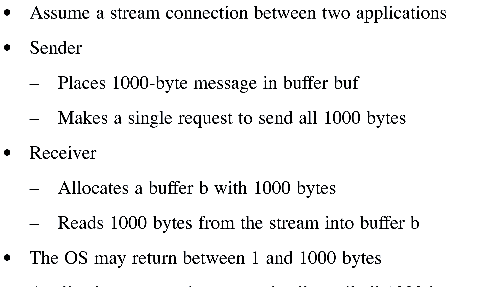
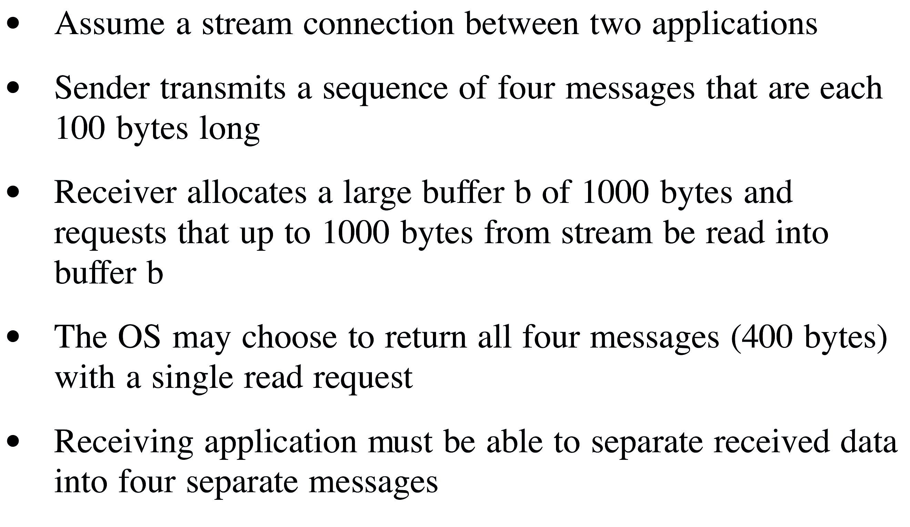
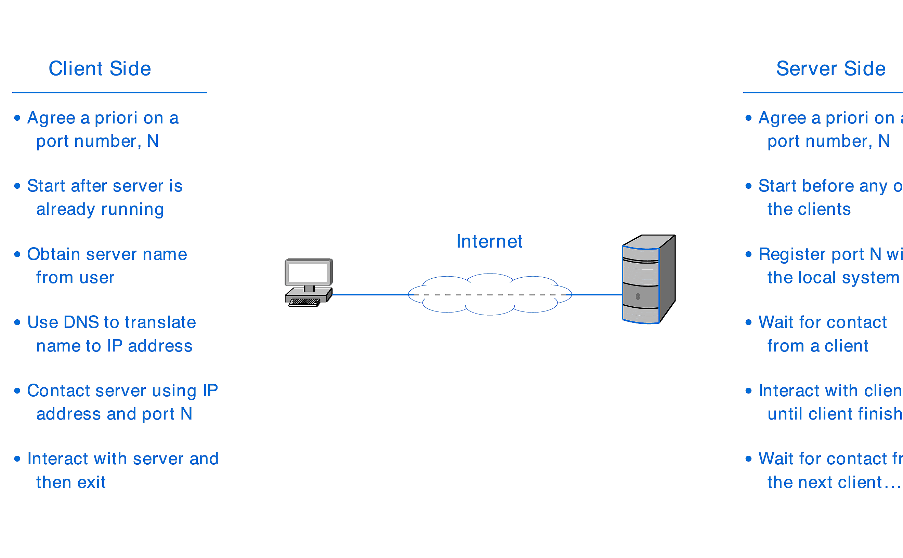
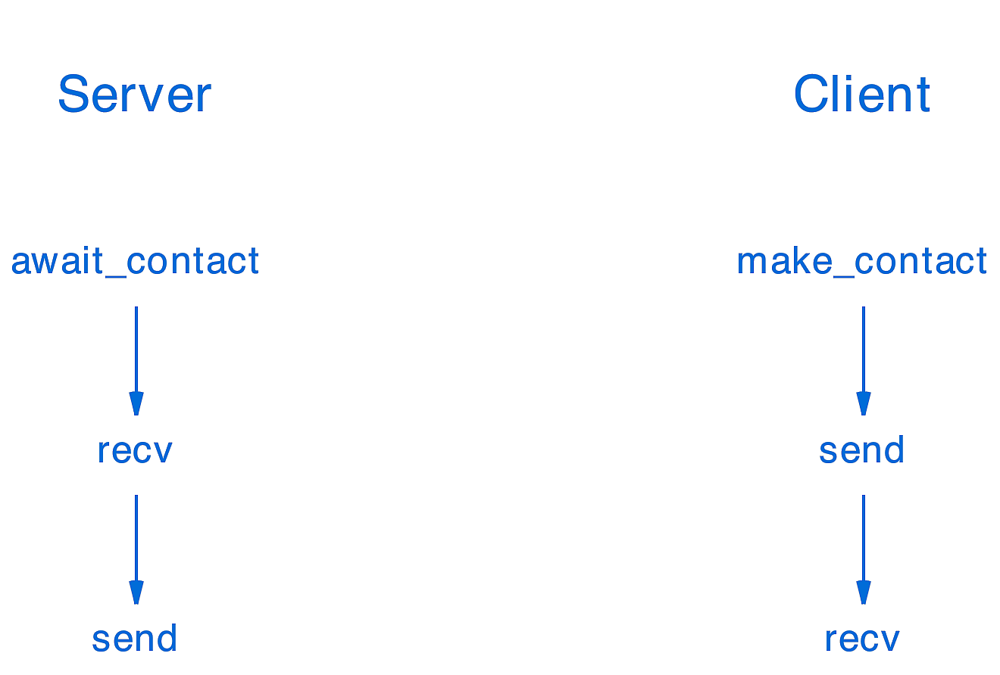
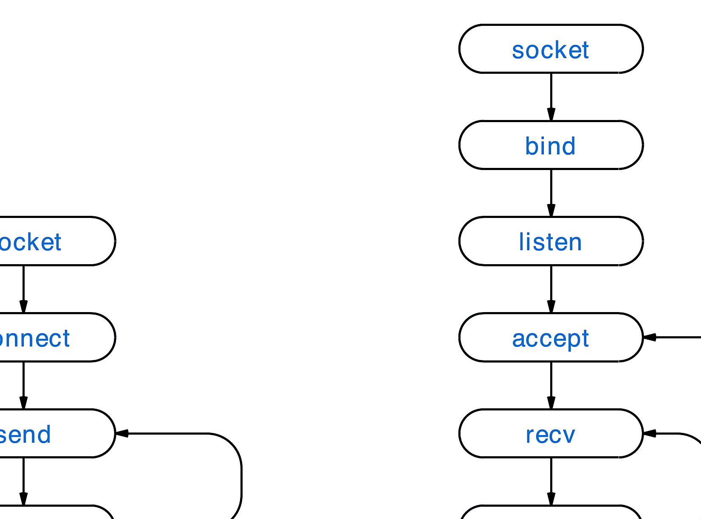
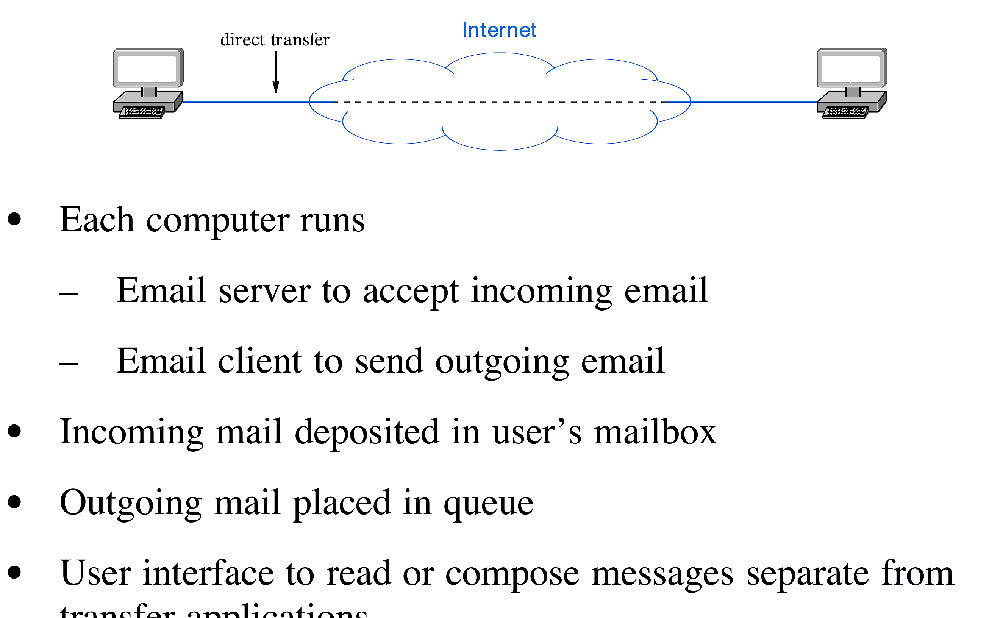
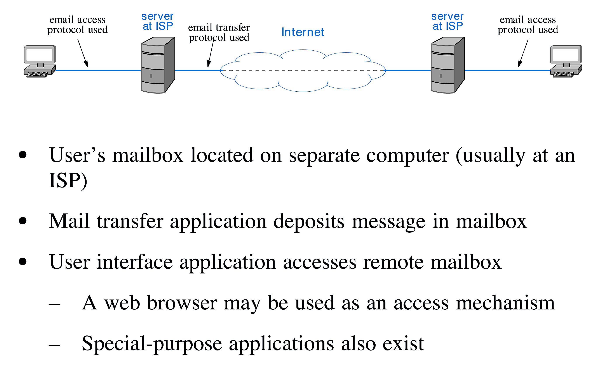
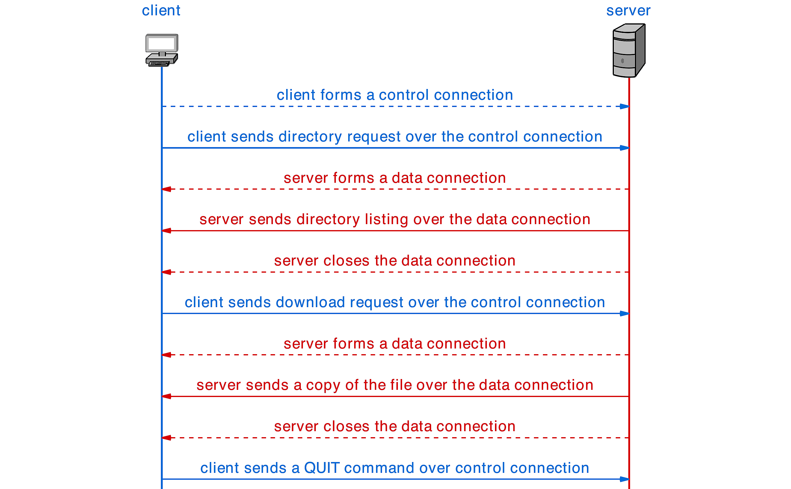
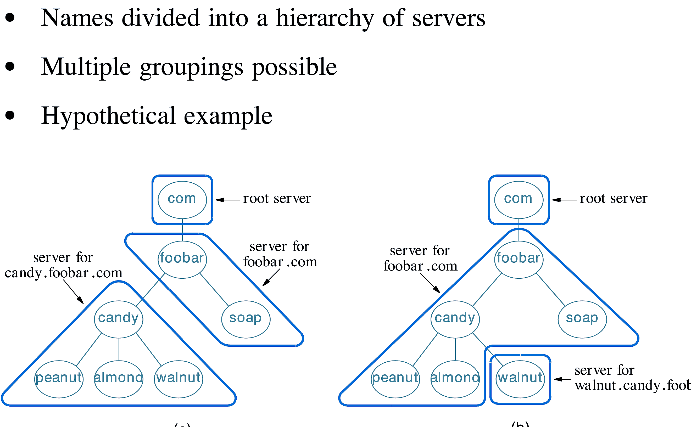
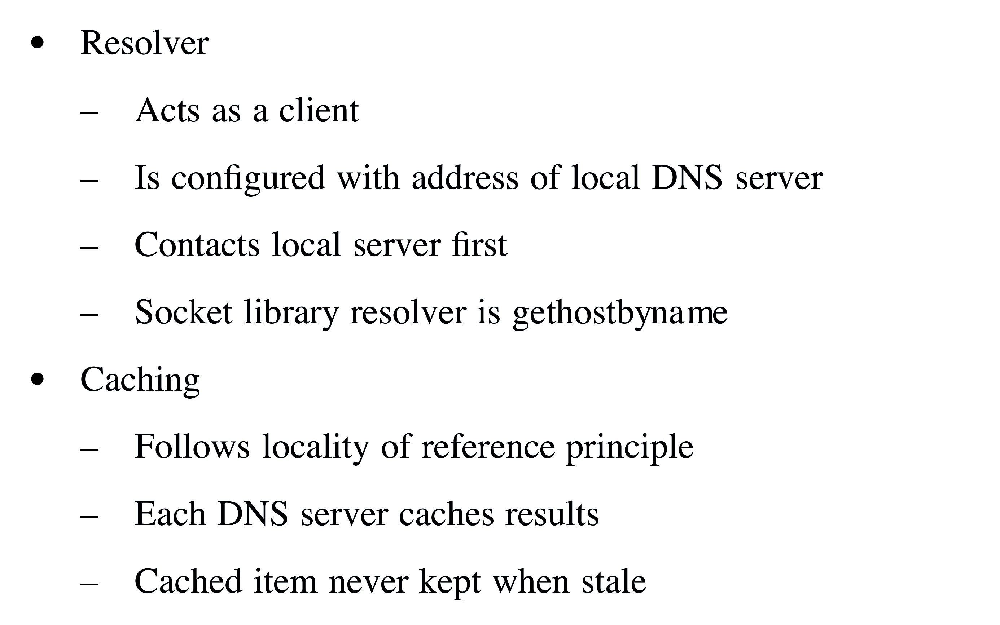

<!-- _class: lead -->
# Modül 2: Uygulama Katmanı ve Ağ Programlama

## Uygulama Katmanı Protokolleri, Soket API ve Ağ Mimarileri

**Prof. Douglas E. Comer** ders materyalinden uyarlanmıştır.

---

# Modül 2 Konu Başlıkları

- İletişim Paradigmaları (Akış vs Mesaj Modeli)
- İstemci-Sunucu (Client-Server) İletişim Modeli
- İstemci-Sunucu Alternatifleri ve P2P Mimarisi
- Soket API ve Ağ Programlama
- Web ve HTTP Protokolü (İstek/Yanıt Formatları)
- E-Posta Mimarisi ve Protokolleri (SMTP, POP3, IMAP, MIME)
- Dosya Aktarımı (FTP Mimarisi)
- Alan Adı Sistemi (DNS - Domain Name System)

---

<!-- _class: lead -->
# Bölüm 2.1: İletişim Paradigmaları ve Genel İlkeler

---

# Temel İlke: Zekanın Ağ Uçlarında Olması

- **Uç Sistemlerde Zeka (Intelligence At The Edge)**:
  - İnternet'in temel tasarım ilkesi: Ağ çekirdeği basit paket iletimi yapar; karmaşık uygulama mantığı ve zeka uç sistemlerde (host) çalışır.
  - Uygulama katmanı protokolleri uç sistemlerde çalışan yazılımlar tarafından yürütülür.
  - İnternet altyapısı yeni bir uygulama eklendiğinde değiştirilmek zorunda kalmaz.

---

# Temel İletişim Paradigmaları

Ağ uygulamaları geliştirmek için iki ana iletişim paradigması mevcuttur:

1. **Akış Modeli (Stream Paradigm / TCP)**:
   - Bağlantı tabanlıdır (connection-oriented).
   - Veri sürekli bir bayt akışı olarak iletilir.
2. **Mesaj Modeli (Message Paradigm / UDP)**:
   - Bağlantısızdır (connectionless).
   - Veri bağımsız paketler/mesajlar halinde gönderilir.

---

# Akış Modeli (Stream Paradigm - TCP)

- 1-e-1 iletişim (bir istemci ile bir sunucu arası).
- İletişim kurulmadan önce bağlantı açılmalıdır.
- Kesintisiz bayt akışı (stream of bytes) sağlar:
  - Gönderilen bayt dizisi ile alınan bayt dizisi birebir aynıdır.
- Veri sınırları korunmaz (gönderilen mesaj boyutları birleştirilebilir veya bölünebilir).
- Güvenilir iletim sağlar (kaybolan paketler tekrar gönderilir).

---

# Mesaj Modeli (Message Paradigm - UDP)

- 1-e-1, 1-e-Çok (Multicast) veya 1-e-Herkes (Broadcast) destekler.
- İletişim öncesi bağlantı kurulumu gerektirmez.
- Veri sınırları kesin olarak korunur:
  - Bir mesaj gönderildiğinde, alıcı tam olarak o boyutta tek bir mesaj alır.
- Güvenilirlik garantisi yoktur (paketler kaybolabilir, sırasız gelebilir veya yinelenebilir).
- Mesaj boyutu genellikle maksimum paket boyutu ile sınırlıdır (örn. 64 KB).

---

# Akış Taşıma ve Veri Parçalanması (Data Chunks)



- Akış modelinde uygulama veriyi rastgele boyutlarda yazar.
- Ağ yazılımı bu veriyi uygun boyutlu bloklara/parçalara ayırarak paketler.
- Alıcı uygulama veriyi tek bir okumada alabileceği gibi parça parça da okuyabilir.

---

# Mesaj Modeli ve Mesaj Sınırları



- Mesaj modelinde her bir mesaj ağ üzerinden bağımsız bir birim olarak iletilir.
- Alıcı uygulama tam olarak gönderilen mesaj boyutu kadar tek bir birim alır.
- Mesaj sınırları ağ katmanında kesinlikle korunur.

---

<!-- _class: lead -->
# Bölüm 2.2: İstemci-Sunucu Modeli ve Mimariler

---

# İstemci-Sunucu (Client-Server) Etkileşim Modeli

- İnternet üzerindeki uygulamaların ezici çoğunluğu **İstemci-Sunucu** mimarisini kullanır.
- İki taraf farklı rollere sahiptir:
  - **İstemci (Client)**: Hizmet talep eden taraf (iletişimi başlatan).
  - **Sunucu (Server)**: Hizmeti sunan ve istekleri bekleyen taraf.

---

# İstemcinin Temel Özellikleri

- Geçici olarak çalışır (kullanıcı başlattığında).
- İletişimi başlatan taraftır (active opener).
- Sunucunun adresini (IP ve Port numarası) önceden bilmek zorundadır.
- Genellikle sıradan kullanıcı bilgisayarlarında (PC, akıllı telefon) çalışır.
- İşi bittiğinde sonlanabilir.

---

# Sunucunun Temel Özellikleri

- Sürekli (7/24) çalışır (daemon / service).
- İsteklerin gelmesini pasif olarak bekler (passive opener).
- Önceden tanımlı sabit bir Port numarasında dinleme yapar (well-known port).
- Aynı anda birden fazla istemciye hizmet verebilir (concurrent server).
- Genellikle yüksek performanslı sunucu sınıfı bilgisayarlarda çalışır.

---

# İstemci ve Sunucu Etkileşim Adımları



- İstemci ve sunucu önceden bir port numarası üzerinde anlaşır.
- Sunucu pasif olarak dinlemeye başlar; istemci aktif olarak bağlantı kurar.

---

<!-- _class: compact -->
# İstemci-Sunucu Alternatifleri ve P2P

- **Yayın (Broadcast)**:
  - Gönderici mesajı tüm ağa yayınlar; her istasyon alır. Ölçeklenmesi zordur.
- **Paylaşılan Dosya Sistemi (Shared File System)**:
  - Merkezi dosya sunucusu üzerinden iletişim. Birden fazla erişimde kilitlenme sorunları yaşanabilir.
- **Noktadan Noktaya (Peer-to-Peer / P2P)**:
  - Merkezi sunucu ihtiyacını ortadan kaldırır.
  - Her bir düğüm (peer) hem istemci hem de sunucu gibi davranır.
  - Dosya paylaşımı (BitTorrent vb.) ve dağıtık sistemlerde yaygındır.

---

<!-- _class: lead -->
# Bölüm 2.3: Ağ Programlama Arayüzü ve Soketler

---

# Ağ Programlama ve Soketler (Sockets)

- **Soket (Socket)**: Uygulama katmanı ile Taşıma katmanı (TCP/UDP) arasındaki işletim sistemi arayüzüdür (API).
- 1983 yılında BSD Unix işletim sisteminde tanıtılmıştır (BSD Sockets API).
- Günümüzde tüm işletim sistemlerinde (Linux, Windows, macOS) standart ağ programlama arayüzüdür.

---

# Basitleştirilmiş API Etkileşim Akışı



- İstemci: `make_contact()` -> `send()` -> `recv()` -> `close()`
- Sunucu: `await_contact()` -> `recv()` -> `send()` -> `close()`

---

# TCP İçin Standart Soket API Çağrıları



- Sunucu Tarafı: `socket()` -> `bind()` -> `listen()` -> `accept()` -> `recv()`/`send()` -> `close()`
- İstemci Tarafı: `socket()` -> `connect()` -> `send()`/`recv()` -> `close()`

---

# Port Numaraları ve Adresleme

- Bir bilgisayarda aynı anda çalışan binlerce uygulama olabilir.
- Gelen paketlerin doğru uygulamaya ulaştırılması için **Port Numaraları** kullanılır (16-bit tam sayı: 0 - 65535).
- **Tanınmış Portlar (Well-Known Ports: 0 - 1023)**:
  - HTTP: `80`, HTTPS: `443`, DNS: `53`, SSH: `22`, SMTP: `25`, FTP: `21`
- **Geçici Portlar (Ephemeral Ports: 1024 - 65535)**:
  - İstemciler tarafından geçici iletişim için dinamik olarak atanır.

---

<!-- _class: lead -->
# Bölüm 2.4: Uygulama Katmanı Protokolleri ve Web

---

# Uygulama Katmanı Protokolü Nedir?

- İki uç uygulamanın birbiriyle nasıl mesajlaşacağını belirleyen kurallar bütünüdür.
- Şunları tanımlar:
  - Mesaj türleri (ör. İstek / Yanıt).
  - Mesajların sözdizimi (syntax) ve alan yapıları.
  - Alanların anlamı (semantics).
  - Yanıt verme ve iletişim kuralları.

---

# Web Teknolojileri ve HTTP

Web üç temel standart üzerine inşa edilmiştir:

1. **HTML (HyperText Markup Language)**: Belge içeriğini ve yapısını biçimlendirir.
2. **URL (Uniform Resource Locator)**: İnternet üzerindeki kaynağın adresini belirtir (`http://host:port/path`).
3. **HTTP (HyperText Transfer Protocol)**: İstemci (tarayıcı) ile sunucu arasındaki aktarım protokolüdür.

---

# HTTP İstek Metotları (Request Methods)

- **GET**: Sunucudan belirtilen kaynağı/sayfayı ister (en yaygın metot).
- **POST**: Sunucuya veri gönderir (form doldurma, dosya yükleme).
- **HEAD**: Sadece başlık (header) bilgilerini ister (gövde/body gelmez).
- **PUT**: Sunucuya yeni bir kaynak yükler veya mevcudunu günceller.
- **DELETE**: Sunucudaki kaynağı siler.

---

# HTTP Yanıt Durum Kodları (Response Status Codes)

HTTP yanıtları 3 haneli durum kodları içerir:

- **1xx (Bilgilendirme)**: İstek alındı, işlem devam ediyor.
- **2xx (Başarı)**: `200 OK` (İstek başarıyla işlendi).
- **3xx (Yönlendirme)**: `301 Moved Permanently`, `302 Found`.
- **4xx (İstemci Hatası)**: `404 Not Found`, `403 Forbidden`, `400 Bad Request`.
- **5xx (Sunucu Hatası)**: `500 Internal Server Error`, `503 Service Unavailable`.

---

# HTTP Header (Başlık) Formatı

HTTP mesajları düz metin (text-based) formatındadır:

```http
GET /index.html HTTP/1.1
Host: www.example.com
User-Agent: Mozilla/5.0
Accept: text/html
Connection: keep-alive
```

Sunucu Yanıtı:

```http
HTTP/1.1 200 OK
Date: Thu, 30 Jul 2026 22:00:00 GMT
Server: Apache/2.4.41
Content-Type: text/html; charset=UTF-8
Content-Length: 1256
```

---

<!-- _class: lead -->
# Bölüm 2.5: E-Posta Mimarisi ve Protokolleri

---

# Orijinal vs Günümüz E-Posta Mimarisi



- **Orijinal Model**: Gönderenin bilgisayarı doğrudan alıcının bilgisayarına bağlanıp e-postayı iletir. (Alıcının bilgisayarı kapalıysa e-posta kaybolur).

---

# Günümüz E-Posta Mimarisi



- **Posta Sunucuları (Mail Servers / MTA)**: E-postalar sunucular arasında kesintisiz olarak aktarılır ve kullanıcı posta kutusunda (mailbox) saklanır.
- **Posta Erişim Protokolleri (POP3 / IMAP)**: Kullanıcı istediği zaman sunucudaki kutusundan e-postalarını çeker.

---

# E-Posta Protokolleri Özeti

1. **SMTP (Simple Mail Transfer Protocol - Port 25/587)**:
   - İstemciden sunucuya veya sunucudan sunucuya e-posta göndermek için kullanılır (Push Protokolü).
2. **POP3 (Post Office Protocol v3 - Port 110/995)**:
   - E-postaları sunucudan yerel cihaza indirir ve genellikle sunucudan siler.
3. **IMAP (Internet Message Access Protocol - Port 143/993)**:
   - E-postaları sunucu üzerinde tutar; klasörleri cihazlar arasında senkronize eder.
4. **MIME (Multipurpose Internet Mail Extensions)**:
   - Metin dışı (resim, ses, video, belge) dosyaların e-postaya eklenmesini sağlar.

---

<!-- _class: lead -->
# Bölüm 2.6: Dosya Aktarımı ve Uzaktan Erişim

---

# FTP (File Transfer Protocol) Mimarisi



- FTP çift bağlantı (two-connection) kullanır:
  - **Kontrol Bağlantısı (Port 21)**: Komutlar ve yanıtlar için (TCP).
  - **Veri Bağlantısı (Port 20)**: Dosya içeriğinin aktarımı için (TCP).

---

# Uzaktan Erişim Protokolleri

- **Telnet (Port 23)**:
  - Uzaktaki bir komut satırına erişim sağlar.
  - Güvensizdir; tüm kullanıcı adı, parola ve veriler açık metin (cleartext) olarak iletilir.
- **SSH (Secure Shell - Port 22)**:
  - Telnet'in güvenli alternatifidir.
  - Tüm iletişim ve kimlik doğrulama güçlü kriptografi ile şifrelenir.
  - Günümüzün standart uzaktan yönetim aracıdır.

---

<!-- _class: lead -->
# Bölüm 2.7: Alan Adı Sistemi (DNS)

---

# Alan Adı Sistemi (DNS - Domain Name System)

- İnsanlar isimleri hatırlar (`www.google.com`), bilgisayarlar IP adreslerini kullanır (`142.250.185.78`).
- **DNS**: İsimler ile IP adresleri arasında dönüşüm yapan dağıtık (distributed) bir veritabanı sistemidir.
- UDP ve TCP Port `53` üzerinde çalışır.

---

# Hiyerarşik İsim Alanı ve Kök Sunucular



- **Kök Sunucular (Root Servers)**: Hiyerarşinin en tepesindedir (Dünyada 13 kök IP adresi).
- **Üst Düzey Alan Adı Sunucuları (TLD Servers)**: `.com`, `.org`, `.net`, `.tr` gibi uzantıları yönetir.
- **Yetkili Sunucular (Authoritative Servers)**: Kurumların kendi domain kayıtlarını tutar.

---

# DNS Adres Çözümleme ve Önbellekleme



1. İstemci yerel DNS sunucusuna (Local DNS) başvurur.
2. Yerel DNS sırasıyla Kök -> TLD -> Yetkili sunucuya sorgu gönderir.
3. Sonuç yerel DNS'te önbelleğe (cache) alınır ve istemciye döndürülür.

---

<!-- _class: lead -->
# Bölüm 2.8: Özet ve Değerlendirme

---

# Modül 2 Özeti

- Uygulama katmanı İnternet mimarisinin en üst katmanıdır ve zeka ağın uçlarındadır.
- **Akış (TCP)** ve **Mesaj (UDP)** olmak üzere iki temel iletişim modeli vardır.
- **Soket API**, uygulamaların TCP/IP protokol yığınına erişmesini sağlar.
- Web uygulamaları **HTTP**, **HTML** ve **URL** üzerine kuruludur.
- E-Posta **SMTP**, **POP3/IMAP** ve **MIME** standartlarını kullanır.
- **FTP** kontrol ve veri kanallarını birbirinden ayırır.
- **DNS**, İnternet üzerindeki isim-IP dönüşümünü sağlayan dağıtık bir sistemdir.
